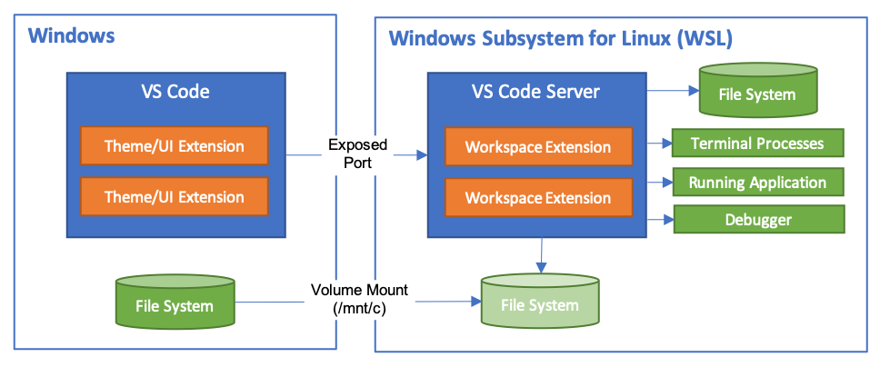
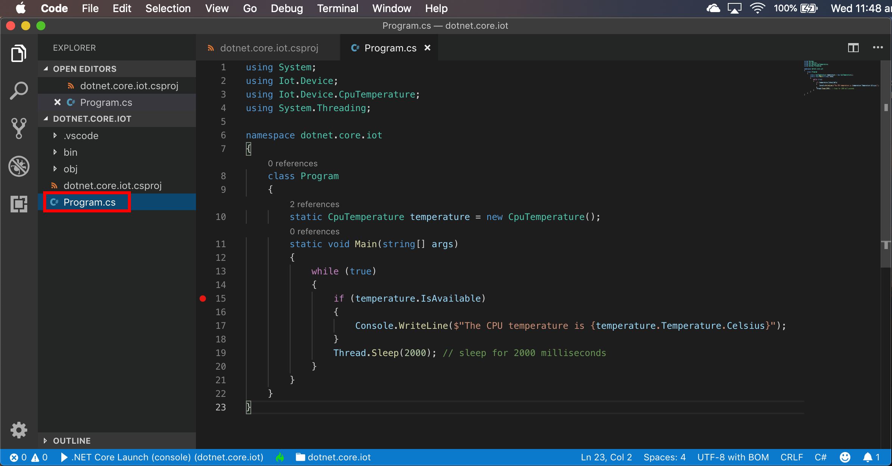
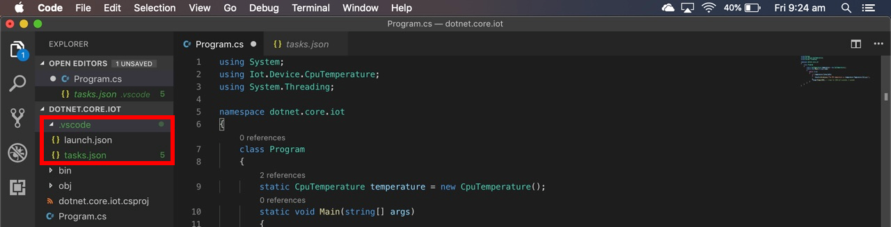
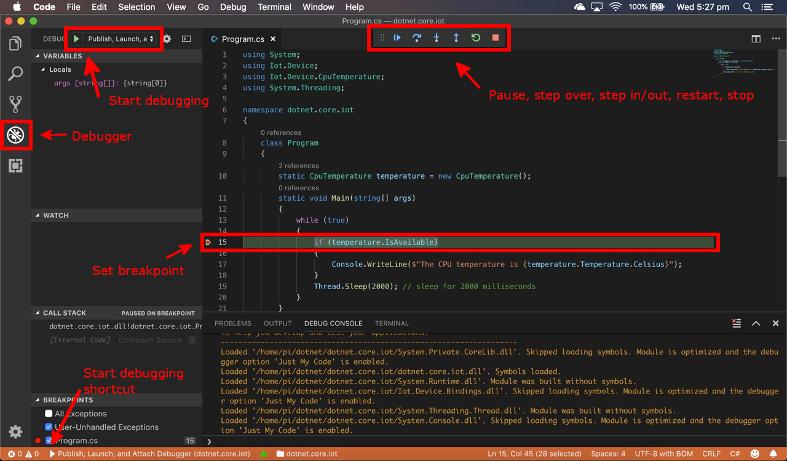

# Create your  first Raspberry Pi .NET Core C# IoT Application


 Follow me on [Twitter](https://twitter.com/dglover) @dglover

---

[Home](../../README.md)

* Lab 1: [Create your  first Raspberry Pi .NET Core C# IoT Application](../Lab_1_Build_dot_NET_Core_app/README.md)
* Lab 2: [Connect a room environment monitor to Azure IoT Central](../Lab_2_Azure_IoT_Central/README.md)
* Lab 3: [Remote control the room temperature](../Lab_3_IoT_Central_and_Device_Twins/README.md)
<!-- * Lab 4: [Create an ASP.NET Core Web to display the room temperature](../Lab_4_Create_ASP_dotNET_Core_WebApp/README.md)
* Lab 5: [Create an ASP.NET Core Web API to return the room temperature](../Lab_5_Create_ASP_dotNET_Core_WebApi/README.md) -->

## Source Code

The source and the samples for this tutorial can be found [here](https://github.com/gloveboxes/Create-RaspberryPi-dotNET-Core-C-Sharp-IoT-Applications).

---


---

## Software Installation


### Install Visual Studio Code on your computer

This tutorial uses Visual Studio Code. Visual Studio Code is a code editor and is one of the most popular **Open Source** projects on [GitHub](https://github.com/microsoft/vscode). Visual Studio Code runs on Linux, macOS, and Windows.

1. Install **[Visual Studio Code](https://code.visualstudio.com/Download?WT.mc_id=julyot-dnc-dglover)**

---

#### Windows 10 users install Windows Subsystem for Linux

This tutorial uses the Windows Subsystem for Linux also known as WSL for building .NET Core applications for the Raspberry Pi.

1. Follow the [Windows Subsystem for Linux (WSL)](https://docs.microsoft.com/en-us/windows/wsl/install-win10?WT.mc_id=julyot-dnc-dglover) installation guide. I suggest you install WSL 2 for a more complete Linux experience from Windows 10.
2. From the Windows Store I suggest you install the [Ubuntu 20.04 LTS](https://www.microsoft.com/store/productId/9N6SVWS3RX71?WT.mc_id=julyot-dnc-dglover) distribution. It is free.
3. This tutorial will refer to Windows 10 users as **Windows 10 WSL** users as you will be using the Windows Subsystem for Linux command prompt.

---

### Start a command prompt on your computer

* **Linux** and **macOS** users start a new terminal command prompt.
* **Windows 10 WSL** users must start a [Windows Subsystem for Linux (WSL)](https://docs.microsoft.com/en-us/windows/wsl/install-win10?WT.mc_id=julyot-dnc-dglover) command prompt. Press <kbd>Windows</kbd>, type **wsl**, then press <kbd>Enter</kbd> to start a new Linux terminal command prompt.

**Leave this command prompt open as you will be using it for the next steps of this tutorial.**

---

### Start your Raspberry Pi

This tutorial assumes your Raspberry Pi is known as **raspberrypi.local**. Depending on your network setup, it might also be known as **raspberrypi**.

1. Power on your Raspberry Pi. It will take about a minute to start the first time. The Raspberry Pi LEDs will stop blinking when it has finished booting up.
2. From the command prompt you opened in the previous step.
3. Log on to the Raspberry Pi over your network

    ```bash
    ssh pi@raspberrypi.local
    ```

4. Update Raspberry Pi OS and reboot the Raspberry Pi.

    ```bash
    sudo apt update && sudo apt upgrade && sudo reboot
    ```

---

### Set up Passwordless SSH access


To streamline the Raspberry Pi .NET C# develop, deploy, debug process I strongly recommend setting up a SSH certificate and copying the SSH public key to the Raspberry Pi. If you don't do this you be prompted for the Raspberry Pi password every time you deploy your app to the Raspberry Pi.

This tutorial assumes the default **raspberrypi.local** host name.

The following creates a new SSH key pair and copies the SSH public key to the Raspberry Pi.

1. From the command prompt.
2. Create an SSH certificate and copy the public certificate to the Raspberry Pi. You will be prompted to trust the Raspberry Pi and for the Raspberry Pi password.

    ```bash
    ssh-keygen -t rsa && ssh-copy-id pi@raspberrypi.local
    ```

---

### Install the Visual Studio Code .NET Debugger

1. From the command prompt.
3. Install the Visual Studio Code .NET Core Debugger on to the Raspberry Pi.
    ```bash
    ssh pi@raspberry.local "curl -sSL https://aka.ms/getvsdbgsh | bash /dev/stdin -r linux-arm -v latest -l ~/vsdbg"
    ```

---

### Install .NET Core SDK on your computer


#### For Linux and Windows 10 WSL users

1. From the command prompt.
2. Head to the [.NET Core download](https://dotnet.microsoft.com/download?WT.mc_id=julyot-dnc-dglover) page and install the .NET Core SDK. A reminder for Windows 10 WSL users. Remember to follow the installation guide for Linux as you must install the .NET Core SDK into your Windows WSL Linux distribution.

#### For macOS users

1. Head to the [.NET Core download](https://dotnet.microsoft.com/download?WT.mc_id=julyot-dnc-dglover) page. Download and install the .NET Core SDK package.

<!-- ---

## Install the git client on your computer

### For Linux and Windows 10 WSL users

1. From the command prompt.
2. Run the following command to install git.
    ```bash
    sudo apt install git
    ```

### For macOS users

Download the latest [Git for Mac installer](https://sourceforge.net/projects/git-osx-installer/files/) and install. For more details, follow these [instructions](https://www.atlassian.com/git/tutorials/install-git). -->

---

## Creating your first .NET Core C# IoT app

The following commands makes a .NET Core project directory, then and create the .NET Core Console app adding the Iot.Device.Bindings package.

1. From the command prompt.
2. Change to your preferred projects directory
3. Create the .NET Core application directory.

    ```bash
    mkdir dotnet.core.iot.csharp && cd dotnet.core.iot.csharp
    ```

4. Create a new .NET Core console application.

    ```
    dotnet new console --langVersion=latest && dotnet add package Iot.Device.Bindings --version 1.*
    ```

## Start Visual Studio Code

1. From the command prompt.
2. Start Visual Studio Code.
    > Note, there is a fullstop after the command. This tell Visual Studio Code to open the project in the current folder.

    ```
    code .
    ```

3. **Windows 10 WSL** users only. This is a onetime operation.
    1. You will be prompted to install the [Visual Studio Code Remote WSL Development Extension](https://code.visualstudio.com/docs/remote/wsl?WT.mc_id=julyot-dnc-dglover). Click **Install**.
    2. **Reopen** the project with Remote-WSL. From Visual Studio Code, press <kbd>F1</kbd>, type and select **Remote-SSH**.

    > The Visual Studio Code Remote - WSL extension lets you use the Windows Subsystem for Linux (WSL) as your full-time development environment right from VS Code. You can develop in a Linux-based environment, use Linux-specific toolchains and utilities, and run and debug your Linux-based applications all from the comfort of Windows.
    

---

## Add the Visual Studio Code Build and Debug assets

1. Click **Yes** to add required assets to build and debug.

    

2. Open the **program.cs** file.

3. Replace the code in program.cs file with the following code. This code will read the Raspberry Pi CPU Temperature and display it in the system console window.

```c#
using System;
using Iot.Device.CpuTemperature;
using System.Threading;

namespace dotnet.core.iot
{
    class Program
    {
        static CpuTemperature temperature = new CpuTemperature();
        static void Main(string[] args)
        {
            while (true)
            {
                if (temperature.IsAvailable)
                {
                    Console.WriteLine($"The CPU temperature is {temperature.Temperature.Celsius}");
                }
                Thread.Sleep(2000); // sleep for 2000 milliseconds, 2 seconds
            }
        }
    }
}
```

Your Visual Studio Code **program.cs** file should look like the following screenshot.



---

## Deploying the project to your Raspberry Pi

To deploy a project to your Raspberry Pi you need to configure Visual Studio Code to compile for **linux-arm**, how to copy the compiled code to the Raspberry Pi, and finally how to attach the debugger.

For this tutorial, we are going to use [rsync](https://en.wikipedia.org/wiki/Rsync) to copy program files to the Raspberry Pi. Rsync is a very efficient file transfer protocol, comes standard with Linux, macOS, and Windows with the [Windows Subsystem for Linux (WSL)](https://docs.microsoft.com/en-us/windows/wsl/install-win10?WT.mc_id=julyot-dnc-dglover) installed.

---

## Update the Launch and Build Task configurations

We need to update the [launch.json](https://code.visualstudio.com/docs/editor/debugging?WT.mc_id=julyot-dnc-dglover) and [tasks.json](https://code.visualstudio.com/docs/editor/debugging?WT.mc_id=julyot-dnc-dglover) files with the following code.



### Set the launch.json configuration

The launch configuration is responsible for calling the build task, and instructing the Raspberry Pi to start the Visual Studio Code debugger and load the application.

1. Open the **.vscode** directory from the Visual Studio Code Explorer.
2. Open the **launch.json** file.
3. Replace the contents of the launch.json file with the following JSON configuration.

    ```json
    {
        "version": "0.2.0",
        "configurations": [      
            {
                "name": "Raspberry Pi Publish, Launch, and Attach Debugger",
                "env":{"IOT_HUB_CONNECTION_STRING": ""},
                "type": "coreclr",
                "request": "launch",
                "preLaunchTask": "RaspberryPublish",
                "program": "~/${workspaceFolderBasename}/${workspaceFolderBasename}",
                "cwd": "~/${workspaceFolderBasename}",
                "stopAtEntry": false,
                "console": "internalConsole",
                "pipeTransport": {
                    "pipeCwd": "${workspaceRoot}",
                    "pipeProgram": "/usr/bin/ssh",
                    "pipeArgs": [
                        "pi@raspberrypi.local"
                    ],
                    "debuggerPath": "~/vsdbg/vsdbg"
                }
            }
        ]
    }
    ```

4. If you renamed your Raspberry Pi you will need to update the launch.json file with the name or IP address of your Raspberry Pi. [Find and Replace](https://code.visualstudio.com/docs/editor/codebasics?WT.mc_id=julyot-dnc-dglover) **raspberrypi.local** with the host name or IP address of your Raspberry.

### Set the tasks.json configuration

The build task is responsible for compiling the application and copying the code to the Raspberry Pi using [rsync](https://en.wikipedia.org/wiki/Rsync). Rsync is a very efficient file transfer protocol, comes standard with Linux, macOS. The first time you build the application the complete application and supporting libraries will be copied to the Raspberry Pi. For subsequent builds, only changed files are copied.

1. From the **.vscode** directory from the Visual Studio Code Explorer.
2. Open the **tasks.json** file.
3. Replace the contents of the tasks.json file with the following JSON configuration.

    ```json
    {
        "version": "2.0.0",
        "tasks": [
            {
                "label": "RaspberryPublish",
                "command": "sh",
                "type": "shell",
                "problemMatcher": "$msCompile",
                "args": [
                    "-c",
                    "\"dotnet publish -r linux-arm -c Debug -o ./bin/linux-arm/publish ./${workspaceFolderBasename}.csproj && rsync -rvuz ./bin/linux-arm/publish/ pi@raspberrypi.local:~/${workspaceFolderBasename}\"",
                ]
            }
        ]
    }
    ```

4. If you renamed your Raspberry Pi you will need to update the tasks.json file with the name or IP address of your Raspberry Pi. [Find and Replace](https://code.visualstudio.com/docs/editor/codebasics?WT.mc_id=julyot-dnc-dglover) **raspberrypi.local** with the host name or IP address of your Raspberry.

---

## Build, Deploy and Debug your .NET Core IoT App

Review this [Visual Studio Debugger Guide](https://code.visualstudio.comresources/editor/debugging?WT.mc_id=julyot-dnc-dglover) if you've not used the debugger before.

Set a breakpoint in your code, for example at the 15, and from Visual Studio Code click the Debug icon on the Activity bar, ensure "**Publish, Launch and Attach Debugger**" is selected in the dropdown, and click the green run icon.

Your code will build, it will be copied to your Raspberry Pi and the debugger will be attached and you can now start stepping through your code.



### Viewing debugger output

As part of the debug process the Visual Studio Code **DEBUG CONSOLE** will be activated. The output from the C# **Console.WriteLine** will be displayed in the debug console.


---

## Connect your Raspberry Pi to Azure IoT Hub

1. Follow the "[Create an Azure IoT Hub (Free)](https://docs.microsoft.com/en-us/azure/iot-hub/quickstart-send-telemetry-dotnet?WT.mc_id=julyot-dnc-dglover)" tutorial until the "Send simulated telemetry" section. You will need to the connection string of the device you created.

2. Add the Package references for Azure IoT Hub and JSON.NET. This can either be done by executing the 'dotnet add package' command, or by updating the references directly in the .csproj file.

Open the dotnet.core.iot.csharp.csproj file and update the <ItemGroup> section as follows.

```xml
<ItemGroup>
    <PackageReference Include="Iot.Device.Bindings" Version="0.1.0-prerelease*" />
    <PackageReference Include="Microsoft.Azure.Devices.Client" Version="1.*" />
    <PackageReference Include="Newtonsoft.Json" Version="12.0.1" />  
</ItemGroup>
```

3. Replace the code in program.cs file with the following code and add your device connection string.

This code will read the Raspberry Pi CPU Temperature, display it, then send the telemetry to Azure IoT Hub.

```c#
using System;
using Iot.Device.CpuTemperature;
using Newtonsoft.Json;
using Microsoft.Azure.Devices.Client;
using System.Text;
using System.Threading;
using System.Threading.Tasks;

namespace dotnet.core.iot
{
    class Program
    {
        const string DeviceConnectionString = "<Your Azure IoT Hub Connection String>";

        // Replace with the device id you used when you created the device in Azure IoT Hub
        const string DeviceId = "<Your Device Id>";
        static DeviceClient _deviceClient = DeviceClient.CreateFromConnectionString(DeviceConnectionString, TransportType.Mqtt);
        static CpuTemperature _temperature = new CpuTemperature();
        static int _msgId = 0;
        const double TemperatureThreshold = 42.0;

        static async Task Main(string[] args)
        {
            while (true)
            {
                if (_temperature.IsAvailable)
                {
                    Console.WriteLine($"The CPU temperature is {Math.Round(_temperature.Temperature.Celsius, 2)}");
                    await SendMsgIotHub(_temperature.Temperature.Celsius);
                }
                Thread.Sleep(2000); // sleep for 2000 milliseconds
            }
        }

        private static async Task SendMsgIotHub(double temperature)
        {
            var telemetry = new Telemetry() { Temperature = Math.Round(temperature, 2), MessageId = _msgId++ };
            string json = JsonConvert.SerializeObject(telemetry);

            Console.WriteLine($"Sending {json}");

            Message eventMessage = new Message(Encoding.UTF8.GetBytes(json));
            eventMessage.Properties.Add("temperatureAlert", (temperature > TemperatureThreshold) ? "true" : "false");
            await _deviceClient.SendEventAsync(eventMessage).ConfigureAwait(false);
        }

        class Telemetry
        {
            [JsonPropertyAttribute (PropertyName="temperature")] 
            public double Temperature { get; set; } = 0;

            [JsonPropertyAttribute (PropertyName="messageId")] 
            public int MessageId { get; set; } = 0;

            [JsonPropertyAttribute (PropertyName="deviceId")] 
            public string DeviceId {get; set;} = Program.DeviceId;
        }
    }
}
```

---

## Redeploy the App to the Raspberry Pi

Press F5 to run the current 'Publish, Launch, and Attach Debugger' build task.

---

## Monitor the Azure IoT Hub Telemetry

1. Install the [Visual Studio IoT Hub Toolkit](https://marketplace.visualstudio.com/itemdetails?itemName=vsciot-vscode.azure-iot-toolkit&WT.mc_id=julyot-dnc-dglover).

2. Review the [Visual Studio IoT Hub Toolkit](https://github.com/Microsoft/vscode-azure-iot-toolkit/wiki)] Wiki for information on using the IoT Hub Toolkit Visual Studio Extension.

## References

[Remote Debugging On Linux Arm](https://github.com/OmniSharp/omnisharp-vscode/wiki/Remote-Debugging-On-Linux-Arm)

[Azure IoT libraries for .NET](https://docs.microsoft.com/en-au/dotnet/api/overview/azure/iot?view=azure-dotnet&WT.mc_id=julyot-dnc-dglover)

---

## Quick Notes

Using the new built in Windows OpenSSH client. Windows 10 1809+

Install OpenSSH Client on Windows (one time only operation).

From PowerShell as Administrator

```bash
Add-WindowsCapability -Online -Name OpenSSH.Client
```

Close PowerShell and reopen as **non administrator** user.


```bash
ssh-keygen -t rsa ; `
cat ~/.ssh/id_rsa.pub | ssh user@123.45.56.78 "mkdir ~/.ssh; cat >> ~/.ssh/authorized_keys"
```

References

- [Is there an equivalent to ssh-copy-id for Windows?](https://serverfault.com/questions/224810/is-there-an-equivalent-to-ssh-copy-id-for-windows)
- [Installation of OpenSSH For Windows Server 2019 and Windows 10](https://docs.microsoft.com/en-us/windows-server/administration/openssh/openssh_install_firstuse?WT.mc_id=julyot-dnc-dglover)
