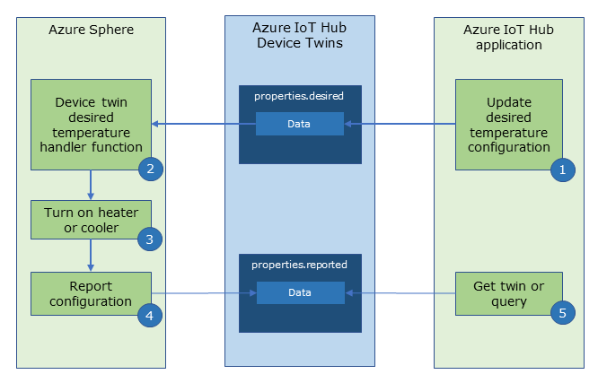
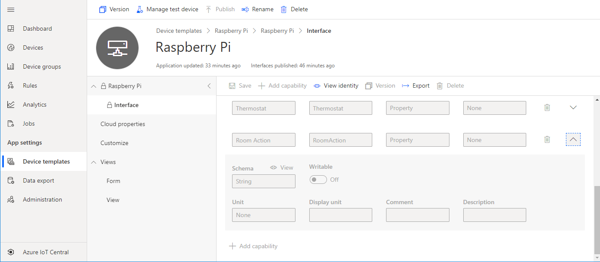
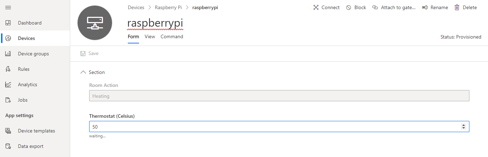

# Lab 3: Remote control the room temperature

---

|Author|[Dave Glover](https://developer.microsoft.com/en-us/advocates/dave-glover?WT.mc_id=github-blog-dglover), Microsoft Cloud Developer Advocate, [@dglover](https://twitter.com/dglover) |
|:----|:---|
|Date| March 2020|

---

## Raspberry Pi .NET Core C# Learning Path

Each module assumes you have completed the previous module.

[Home](../../README.md)

* Lab 1: [Create your  first Raspberry Pi .NET Core C# IoT Application](../labs/Lab_1_Build_dot_NET_Core_app/README.md)
* Lab 2: [Connect a room environment monitor to Azure IoT Central](../labs/Lab_2_Azure_IoT_Central/README.md)
* Lab 3: [Remote control the room temperature](../labs/Lab_3_IoT_Central_and_Device_Twins/README.md)

---

## What you will learn

You will learn how to control your Raspberry Pi using [Azure IoT Central](https://azure.microsoft.com/services/iot-central/?WT.mc_id=github-blog-dglover) Properties.

---

## Prerequisites

This lab assumes you have completed [Connect a room environment monitor to Azure IoT Central](../Lab_2_Azure_IoT_Central/README.md). You will have created an Azure IoT Central application and configured your Raspberry Pi IoT Central connection.

---

## Tutorial Overview

There are three options for Azure IoT cloud to device communications: 

1. [Direct Methods](https://docs.microsoft.com/en-us/azure/iot-hub/iot-hub-devguide-direct-methods?WT.mc_id=github-blog-dglover) for communications that require immediate confirmation of the result. Direct methods are often used for interactive control of devices, such as turning on a fan.

2. [Device Twins](https://docs.microsoft.com/en-us/azure/iot-hub/iot-hub-devguide-device-twins?WT.mc_id=github-blog-dglover) are for long-running commands intended to put the device into a certain desired state. For example, set the sample rate for a sensor to every 30 minutes.

3. [Cloud-to-device](https://docs.microsoft.com/en-us/azure/iot-hub/iot-hub-devguide-messages-c2d?WT.mc_id=github-blog-dglover) messages are for one-way notifications to the device app.

This lab will cover Azure IoT Device Twins.

---

## Key Concepts

## Azure IoT Device Twins

Device twins are JSON documents that store device information, including metadata, configurations, and conditions. Azure IoT Hub keeps a device twin for each device that you connect to IoT Hub. Azure IoT Central is an application built on Azure IoT Hub, and it uses device twins to manage properties.

You can use device twins as follows:

1. **Cloud to device updates**.

	A user sets an Azure IoT Central device property. For example, to set the temperature of the room. IoT Central sends a desired property device twin message to the device. The device implements the desired property, and then the device responds with a reported property device twin message. Azure IoT Hub stores the reported property. 
2. **Device to cloud updates**.

	A device can send a reported property device twin message to Azure. For example, a device could report its firmware level on startup.  Azure IoT Hub stores the reported property.

3. **Querying reported properties**.

	With device twins reported state stored in Azure, it is possible to query the stored device twin properties cloud side. For example, list all devices with a firmware version less than 2.0, as these devices require an update. Or, list all rooms with a temperature setting higher than 25 degrees Celsius.

The following outlines how Azure IoT Central uses Device Twins to set properties on a device: 

1. A user sets the value of a property in Azure IoT Central. For example, set the desired room temperature.
2. Azure IoT Hub sends a desired property message to the device. 
3. The device implements the desired property; in this case, turn on the heater or cooler to bring the room to the desired temperature.
4. The device sends a reported property message back to Azure IoT. In this example, the device would report the room action. Was the heater or air conditioner turned on.
5. Azure IoT Central queries and displays the devices reported property data.



For more information, refer to the [Understand and use device twins in IoT Hub](https://docs.microsoft.com/en-us/azure/iot-hub/iot-hub-devguide-device-twins?WT.mc_id=github-blog-dglover) article.

---

## Cloud to device updates

Azure IoT Central properties are implemented on Azure IoT Hub device twins. 

### Cloud to Device Updates

```csharp
private static async Task DeviceTwinGetInitialState(DeviceClient iotClient)
{
    Twin twin = await iotClient.GetTwinAsync().ConfigureAwait(false);
    if (twin.Properties.Desired.Contains("Thermostat"))
    {
        int.TryParse(Convert.ToString(twin.Properties.Desired["Thermostat"]["value"]), out thermostat);
    }
}
```

```csharp
private static async Task OnDesiredPropertyChangedAsync(TwinCollection desiredProperties, object userContext)
{
    if (desiredProperties.Contains("Thermostat"))
    {
        int.TryParse(Convert.ToString(desiredProperties["Thermostat"]["value"]), out thermostat);
    }
}
```

### Device to Cloud Updates

```csharp
private static async Task UpdateRoomAction(DeviceClient iotClient, RoomAction roomState)
{
    if (roomState != previousRoomState)
    {
        TwinCollection reportedProperties = new TwinCollection();
        reportedProperties["RoomAction"] = roomState.ToString();
        await iotClient.UpdateReportedPropertiesAsync(reportedProperties).ConfigureAwait(false);

        previousRoomState = roomState;
    }
}
```

---

## Azure IoT Central device properties

Azure IoT Central device properties are defined in Device templates.  

1. From Azure IoT Central, navigate to **Device template**, and select the **Raspberry Pi** template.
2. Click on **Interface** to list the interface capabilities.
3. Scroll down and expand the **Room Action** capability.
4. Review the definition of **Room Action**. The capability type is **Property**, the Schema type is **String**.

    

---

## Start Lab 3

### Step 1 Open the command prompt on your computer

* **Linux** and **macOS** users start a new terminal command prompt.
* **Windows 10 WSL** users must start a [Windows Subsystem for Linux (WSL)](https://docs.microsoft.com/en-us/windows/wsl/install-win10) command prompt. Press <kbd>Windows</kbd>, type **wsl**, then press <kbd>Enter</kbd> to start a new Linux terminal command prompt.

### Step 2: Open the lab project

1. Change to the **raspberry-pi-dot-net-learning-path** directory
2. Change to the **samples** directory
3. Change to **dotnet.core.iot.csharp.dps.iot-central** directory
4. Start Visual Studio Code.

    ```bash
    code .
    ```

### Step 3: Configure the project environment file

1. Switch back to Visual Studio Code
2. Open the **.env** file
3. If you saved the .env file to Notepad or similar text editor then copy and paste configure to this labs .env file. Failing that, open the .env file in lab 2 and copy the contents to the lab 3 .env file.

### Step 4: Start the app build deploy process

1. From Visual Studio Code, press <kbd>F5</kbd> to build, deploy, start, and attached the remote debugger to the application now running the Raspberry Pi.

---

## Set the thermostat

A desired thermostat device twin property message is sent to the Raspberry Pi Sphere where it will be acted upon.

When the temperature sensor is read on the Raspberry Pi it is compared to the thermostat.

* If the temperature is greater than the thermostat then a room action "**Cooler**" device twin message is sent to IoT Central.
* If the temperature is less than the thermostat then a room action "**Heater**" device twin message is sent to IoT Central.
* If the temperature is equal to the thermostat then a room action "**Green**" device twin message is sent to IoT Central.


To set the thermostat:

1. Update the **Thermostat** value.
2. Save the Property.
	This will send the desired thermostat property to the Raspberry Pi.
3. In a moment the **Room action** property will be update.
    	>Note, IoT Central does not update immediately, it might take a minute or two for the **Room state** property to change.



---

## Close Visual Studio Code

Now close **Close Visual Studio Code**.

---

## Finished 完了 fertig finito समाप्त terminado

Congratulations you have finished lab 3.


---

**[NEXT](../Lab_4_Control_Device_with_Direct_Methods/README.md)**

---
