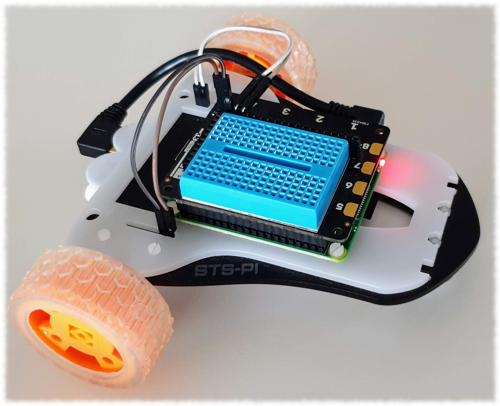
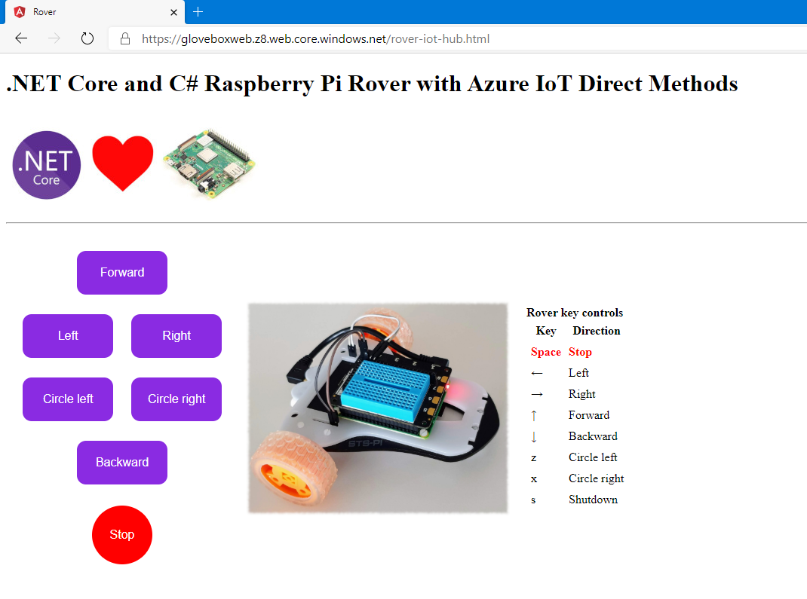
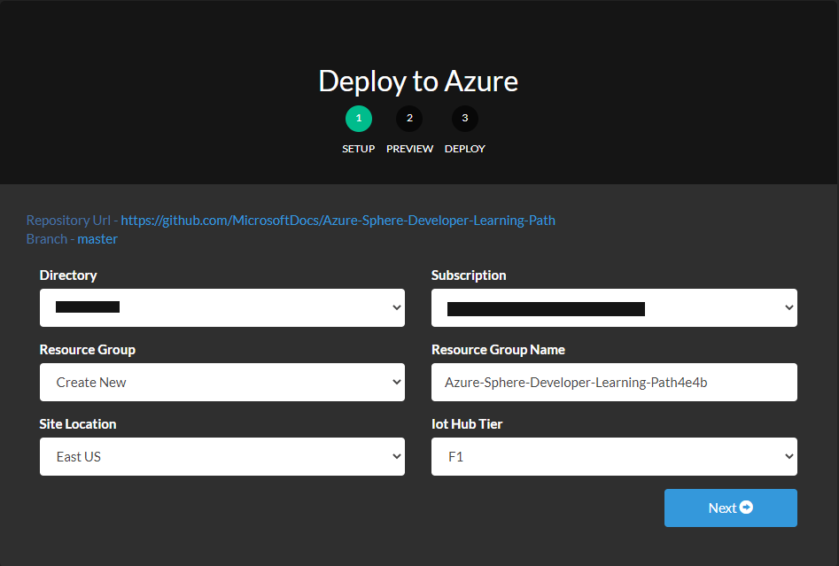
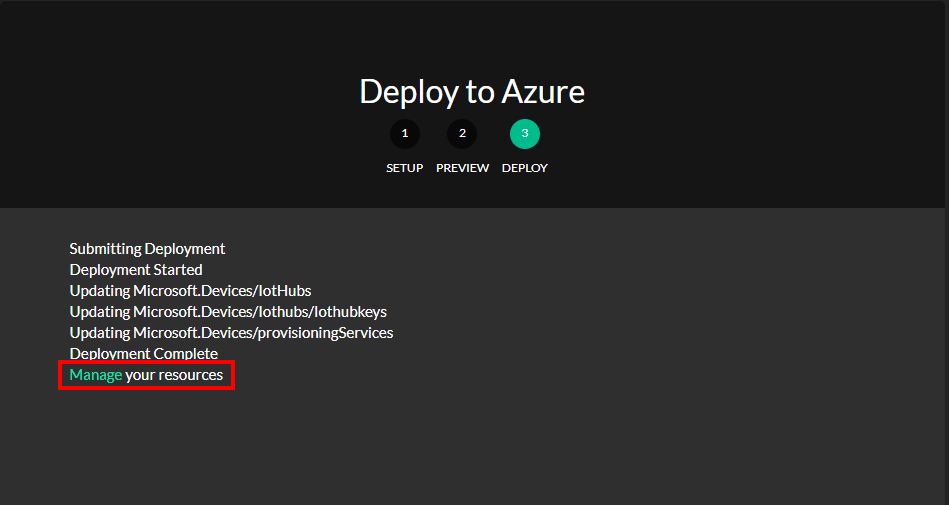
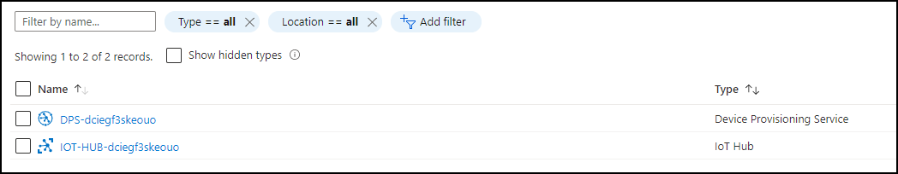

# Build a C# .NET Core Raspberry Pi Rover Robot integrated with Azure IoT


 Follow me on [Twitter](https://twitter.com/dglover).

---

## Source Code

The source and the samples for this walk-through can be found [here](https://github.com/gloveboxes/Rpi.Rover.NET.Core.IoT.Hub).

---

## Introduction

The .NET Core IoT Library connects your applications to hardware. In this walk-through you will learn how to:

1. Develop a C# .NET Core IoT application from your Linux, macOS or Windows 10 computer,
2. Streamline the develop, deploy, and debug process using Visual Studio Code,
3. Use the [.NET Core IoT](https://dotnet.microsoft.com/apps/iot) library to control motors,
4. Remote control your Rover robot using [Azure Static websites](https://docs.microsoft.com/en-us/azure/storage/blobs/storage-blob-static-website-how-to?tabs=azure-portal) and [Azure IoT direct methods](https://docs.microsoft.com/en-us/azure/iot-hub/iot-hub-devguide-direct-methods),
5. Stream telemetry to [Azure IoT Hub](https://docs.microsoft.com/en-us/azure/iot-hub/about-iot-hub?WT.mc_id=github-blog-dglover),
6. Capture Rover actions to [Azure Cosmos DB](https://docs.microsoft.com/en-us/azure/cosmos-db/) using [Azure Functions](https://docs.microsoft.com/en-us/azure/azure-functions/),
7. Analysis Rover Actions with [Cosmos DB Jupyter Notebooks](https://docs.microsoft.com/en-us/azure/cosmos-db/cosmosdb-jupyter-notebooks).

---

## Why .NET Core

It used by millions of developers, it is mature, fast, supports multiple programming languages (C#, F#, and VB.NET), runs on multiple platforms (Linux, macOS, and Windows), and is supported across multiple processor architectures. It is used to build device, cloud, and IoT applications.

[.NET Core](https://docs.microsoft.com/en-au/dotnet/core?WT.mc_id=github-blog-dglover) is an [open-source](https://github.com/dotnet/coreclr/blob/master/LICENSE.TXT), general-purpose development platform maintained by Microsoft and the .NET community on [GitHub](https://github.com/dotnet/core).

---

## The .NET Core IoT Libraries Open Source Project

The Microsoft .NET Core team along with the developer community are building support for [IoT](https://en.wikipedia.org/wiki/Internet_of_things) scenarios. The [.NET Core IoT Library](https://github.com/dotnet/iot) is supported on Linux, and Windows IoT Core, across ARM and Intel processor architectures. See the [.NET Core IoT Library Roadmap](https://github.com/dotnet/iot/blob/master/Documentation/roadmap.md) for more information.

### System.Device.Gpio

The [System.Device.Gpio](https://www.nuget.org/packages/System.Device.Gpio)  package supports general-purpose I/O ([GPIO](https://en.wikipedia.org/wiki/General-purpose_input/output)) pins, PWM, I2C, SPI and related interfaces for interacting with low-level hardware pins to control hardware sensors, displays and input devices on single-board-computers; [Raspberry Pi](https://www.raspberrypi.org/), [BeagleBoard](https://beagleboard.org/), [HummingBoard](https://www.solid-run.com/nxp-family/hummingboard/), [ODROID](https://www.hardkernel.com/), and other single-board-computers that are supported by Linux and Windows 10 IoT Core.

### Iot.Device.Bindings

The [.NET Core IoT Repository](https://github.com/dotnet/iot/tree/master/src) contains [IoT.Device.Bindings](https://www.nuget.org/packages/Iot.Device.Bindings), a growing set of community-maintained device bindings for IoT components that you can use with your .NET Core applications. If you can't find what you need then porting your own C/C++ driver libraries to .NET Core and C# is pretty straight forward too.

The drivers in the repository include sample code along with wiring diagrams. For example the [BMx280 - Digital Pressure Sensors BMP280/BME280](https://github.com/dotnet/iot/tree/master/src/devices/Bmxx80).


---

## Rover Robot

I used the following kit.

1. [Raspberry Pi 3 Model A+](https://www.raspberrypi.org/products/raspberry-pi-3-model-a-plus/)
2. [Pimoroni Explore HAT Pro](https://shop.pimoroni.com/products/explorer-hat). It has two H-bridge motor drivers.
3. Battery. I found a nice [flat battery](https://www.officeworks.com.au/shop/officeworks/p/comsol-slim-powerbank-3600mah-white-copb36wh) that was the perfect fit. I stuck under the chassis and it also provides a nice center of gravity. Its easily has enough juice to run for a few hours.
4. Short right angle Micro B cable.



### Alternatives Rover chassis

There are plenty of alternate Rover chassis available on various online stores. You will also need to wire up a H-Bridge to drive the motors. Wiring up an H-Bridge is straight forward, see this [tutorial](https://maker.pro/raspberry-pi/tutorial/how-to-control-a-dc-motor-with-an-l298-controller-and-raspberry-pi).

---

## Solution Architecture

tbc



---

## Install Visual Studio Code on your computer

This hands-on lab uses Visual Studio Code. Visual Studio Code is a code editor and is one of the most popular **Open Source** projects on [GitHub](https://github.com/microsoft/vscode). Visual Studio Code runs on Linux, macOS, and Windows.

Install **[Visual Studio Code](https://code.visualstudio.com/Download?WT.mc_id=pycon-blog-dglover)**


---

## Setting up your Raspberry Pi

.Net Core requires an AMR32v7 processor and above, so anything Raspberry Pi 2 or better and you are good to go. Note, Raspberry Pi Zero is an ARM32v6 processor, and not supported.

If you've not set up a Raspberry Pi before then this is a great guide. "[HEADLESS RASPBERRY PI 3 B+ SSH WIFI SETUP (MAC + WINDOWS)](https://desertbot.io/blog/headless-raspberry-pi-3-bplus-ssh-wifi-setup)". The Instructions outlined for macOS will work on Linux.

---

## Start your Raspberry Pi

1. Start your Raspberry Pi.
2. Log on to the Raspberry Pi.
3. Update the Raspberry Pi OS and reboot it.

    ```bash
    sudo apt update && sudo apt upgrade && sudo reboot
    ```

## Configure the Raspberry Pi for Visual Studio Remote SSH Development

The following creates a new SSH key, copies the public key to the Raspberry Pi, and then installs the Visual Studio Debugger on the Raspberry Pi.

This tutorial assumes the default **raspberrypi.local** or **raspberrypi** host name using the default **raspberry** password.

1. Open a new terminal command prompt. Windows users must start a [Windows Subsystem for Linux (WSL)](https://docs.microsoft.com/en-us/windows/wsl/install-win10) command prompt.
2. Create an SSH certificate and copy the public certificate to the Raspberry Pi. You will be prompted to trust the Raspberry Pi and for the Raspberry Pi password.

    ```bash
    ssh-keygen -t rsa && ssh-copy-id pi@raspberrypi.local
    ```
3. Install the Visual Studio Code .NET Core Debugger on to the Raspberry Pi.
    ```bash
    ssh pi@raspberry.local "curl -sSL https://aka.ms/getvsdbgsh | bash /dev/stdin -r linux-arm -v latest -l ~/vsdbg"
    ```

---

## Install .NET Core on your Linux, macOS, Windows computer

1. Open a new terminal command prompt. **Windows** users must start a [Windows Subsystem for Linux (WSL)](https://docs.microsoft.com/en-us/windows/wsl/install-win10) command prompt.

2. Head to the [.NET Core download](https://dotnet.microsoft.com/download) page and install .NET Core. Note, Windows users, as a reminder, you must install .NET Core into your Windows WSL Linux distribution.

---

## Install the git client on your computer

### For Linux and Windows WSL users

1. Open a new terminal command prompt. **Windows** users must start a [Windows Subsystem for Linux (WSL)](https://docs.microsoft.com/en-us/windows/wsl/install-win10) command prompt.
2. Run the following command to install git.
    ```bash
    sudo apt install git
    ```
3. **DO NOT** close the command prompt

### For macOS users

Download the latest [Git for Mac installer](https://sourceforge.net/projects/git-osx-installer/files/) and install. For more details, follow these [instructions](https://www.atlassian.com/git/tutorials/install-git).

## Clone the Rover robot project to your computer

1. Open a new terminal command prompt. **Windows** users must start a [Windows Subsystem for Linux (WSL)](https://docs.microsoft.com/en-us/windows/wsl/install-win10) command prompt.
2. Change to your preferred projects directory
3. Clone the Rover project to your computer by runnin the following command.
    ```bash
    git clone https://github.com/gloveboxes/Rpi.Rover.NET.Core.IoT.Hub.git rover-robot
    ```
4. **DO NOT** close the command prompt

---

## Open the Rover Robot C# project

1. From the command prompt, start Visual Studio Code by typing the following command.
2. Change to the **Rpi.Rover.Iot.Hub.Server** project in the **rover-robot** directory by typing the following:
    ```bash
    cd rover-robot/Rpi.Rover.Iot.Hub.Server
    ```
3. Start Visual Studio Code from the command prompt by typing the following:

    ```bash
    code .
    ```
4. **Windows WSL** users only. This is a onetime operation.
    1. You will be prompted to install the [Visual Studio Code Remote WSL Development Extension](https://code.visualstudio.com/docs/remote/wsl). Click **Install**.
    2. **Reopen** the project with Remote-WSL by pressing <kbd>F1</kbd>, from the Visual Studio prompt, type and select **Remote-SSH**.
5. You will be prompted to resolve dependencies. Click the Restore button.

---

## Review the Rover robot project

1. Open **program.cs** by double clicking on the file from the Visual Studio explorer.

    ```c#
    using System;
    using System.Device.Gpio;
    using System.Diagnostics;
    using System.IO;
    using System.Threading;
    using System.Threading.Tasks;
    using Microsoft.Azure.Devices.Client;
    using Newtonsoft.Json;

    namespace Rpi.Rover.Server
    {
        class Program
        {
            enum MotorMap : byte { TwoPlus = 21, TwoMinus = 26, OnePlus = 19, OneMinus = 20 }
            enum MotorControl { Stop, Forward, LeftForward, RightForward, Backward, SharpLeft, SharpRight, ShutDown }

            private static GpioController controller = new GpioController();
            private static Motor left = new Motor(controller, (int)MotorMap.TwoMinus, (int)MotorMap.TwoPlus);
            private static Motor right = new Motor(controller, (int)MotorMap.OneMinus, (int)MotorMap.OnePlus);

            private static Action[][] direction = new Action[][]{
                new Action[] { left.Stop, right.Stop },         // stop
                new Action[] { left.Forward, right.Forward },   // forward
                new Action[] { left.Stop, right.Forward },      // left
                new Action[] { left.Forward, right.Stop },      // right
                new Action[] { left.Backward, right.Backward},  // backwards
                new Action[] { left.Forward, right.Backward },  // left circle
                new Action[] { left.Backward, right.Forward },  // right circle
                new Action[] { ShutDown, null}                  // shutdown
            };

            private static string deviceConnectionString = Environment.GetEnvironmentVariable("IOT_HUB_CONNECTION_STRING");
            private static TransportType transportType = TransportType.Mqtt;

            private class Control
            {
                public string Direction { get; set; }
            }

            static async Task Main(string[] args)
            {
                using (var deviceClient = DeviceClient.CreateFromConnectionString(deviceConnectionString, transportType))
                {
                    await deviceClient.SetMethodHandlerAsync("Direction", SetDirectionAsync, null).ConfigureAwait(false);
                    Thread.Sleep(Timeout.Infinite);
                }
            }

            static private Task<MethodResponse> SetDirectionAsync(MethodRequest methodRequest, object userContext)
            {
                MotorControl control;

                Control command = JsonConvert.DeserializeObject<Control>(methodRequest.DataAsJson);

                if (command != null && Enum.TryParse(command.Direction, true, out control))
                {
                    Program.direction[(int)control][0]();
                    Program.direction[(int)control][1]();

                    return Task.FromResult(new MethodResponse(new byte[0], 200));
                }

                return Task.FromResult(new MethodResponse(new byte[0], 500));
            }
        }
    }

    ```

---

## Review the Launch and Build Task configurations

1. Open the **.vscode** directory from the Visual Studio Code Explorer
2. Open and review the **launch.json** file. 
    > If you renamed your Raspberry Pi you will need to update this file. [Find and Replace](https://code.visualstudio.com/docs/editor/codebasics#_find-and-replace) **raspberrypi** with the host name or IP address of your Raspberry.

    The launch configuration is responsible for calling the build task, and instructing the Raspberry Pi to start the Visual Studio Code debugger and load the application.

    ```json
    {
        "version": "0.2.0",
        "configurations": [      
            {
                "name": "Raspberry Pi Publish, Launch, and Attach Debugger",
                "env":{"IOT_HUB_CONNECTION_STRING": ""},
                "type": "coreclr",
                "request": "launch",
                "preLaunchTask": "RaspberryPublish",
                "program": "~/${workspaceFolderBasename}/${workspaceFolderBasename}",
                "cwd": "~/${workspaceFolderBasename}",
                "stopAtEntry": false,
                "console": "internalConsole",
                "pipeTransport": {
                    "pipeCwd": "${workspaceRoot}",
                    "pipeProgram": "/usr/bin/ssh",
                    "pipeArgs": [
                        "raspberrypi"
                    ],
                    "debuggerPath": "~/vsdbg/vsdbg"
                }
            }
        ]
    }
    ```

3. Open and review the **tasks.json** file. 
    > Again, if you renamed your Raspberry Pi you will need to update this file. [Find and Replace](https://code.visualstudio.com/docs/editor/codebasics#_find-and-replace) **raspberrypi** with the host name or IP address of your Raspberry Pi.

    The build task is responsible for compiling the application and copying the code to the Raspberry Pi using [rsync](https://en.wikipedia.org/wiki/Rsync). Rsync is a very efficient file transfer protocol, comes standard with Linux, macOS. The first time you build the application the complete application and supporting libraries will be copied to the Raspberry Pi. On subsequent builds, only changed files are copied.

    ```json
    {
        "version": "2.0.0",
        "tasks": [
            {
                "label": "RaspberryPublish",
                "command": "sh",
                "type": "shell",
                "problemMatcher": "$msCompile",
                "args": [
                    "-c",
                    "\"dotnet publish -r linux-arm -c Debug -o ./bin/linux-arm/publish ./${workspaceFolderBasename}.csproj && rsync -rvuz ./bin/linux-arm/publish/ raspberrypi:~/${workspaceFolderBasename}\"",
                ]
            }
        ]
    }
    ```

## Step 1: Create an Azure Subscription

If you do not have an Azure Subscription then [create an Azure Subscription](https://azure.microsoft.com/en-us/free/). Students can sign up for a free [Azure for Students](https://azure.microsoft.com/en-us/free/students/) subscription that does not require credit card verification.

---

## Step 2: Prepare Azure resources

You can prepare Azure cloud resources with the Azure CLI, the Azure Portal Web interface, or deployment templates. For this module, we will be using an Azure deployment template.

Click the **Deploy to Azure** button to deploy Azure resources. An IoT Hub will be created, along with a Raspberry Pi device. An Azure Storage account will also be created to host the Static website as well as support an Azure Function. 

[](https://github.com/gloveboxes/Rpi.Rover.NET.Core.IoT.Hub/tree/master/setup)

1. Select or create a new resource group, choose the site located closest to you, and select the IoT Hub Tier. The default IoT Hub tier is the free **F1** tier. You can only have one free IoT Hub per subscription. If you already have a free IoT Hub then either select S1 ([pricing](https://azure.microsoft.com/en-us/pricing/details/iot-hub/)) or delete your existing free IoT Hub before proceeding.

    

2. Click **Next**.
3. Click **Deploy**. The deployment will take three to four minutes to complete.

    

4. When the deployment has completed, click on **Manage your resources**. You will see two services listed in the Azure Web Portal. The Device Provisioning Service (DPS) and the IoT Hub. Appended to the resource names is a random string to ensure the names are globally unique.

    

5. **DO NOT** close the Azure Web Portal and you will be needing it shortly.

---

## Deploying the project to your Raspberry Pi


### Set Azure IoT Connection String

1. Open Launch.json
    ```json
    "env":{"IOT_HUB_CONNECTION_STRING": "<Replace with your Azure IoT Device connection string>"},
    ```

---

## Build, Deploy and Debug your .NET Core IoT App

Review this [Visual Studio Debugger Guide](https://code.visualstudio.com/resources/editor/debugging?WT.mc_id=github-blog-dglover) if you've not used the debugger before.

Set a breakpoint in your code, for example at the 15, and from Visual Studio Code click the Debug icon on the Activity bar, ensure "**Publish, Launch and Attach Debugger**" is selected in the dropdown, and click the green run icon.

Your code will build, it will be copied to your Raspberry Pi and the debugger will be attached and you can now start stepping through your code.


---


---

## Redeploy the App to the Raspberry Pi

Press F5 to run the current 'Publish, Launch, and Attach Debugger' build task.

---


## References

[Remote Debugging On Linux Arm](https://github.com/OmniSharp/omnisharp-vscode/wiki/Remote-Debugging-On-Linux-Arm)

[Azure IoT libraries for .NET](https://docs.microsoft.com/en-au/dotnet/api/overview/azure/iot?view=azure-dotnet&WT.mc_id=hackster-blog-dglover)

---

## Quick Notes

Using the new built in Windows OpenSSH client. Windows 10 1809+

Install OpenSSH Client on Windows (one time only operation).

From PowerShell as Administrator

```bash
Add-WindowsCapability -Online -Name OpenSSH.Client
```

Close PowerShell and reopen as **non administrator** user.


```bash
ssh-keygen -t rsa ; `
cat ~/.ssh/id_rsa.pub | ssh user@123.45.56.78 "mkdir ~/.ssh; cat >> ~/.ssh/authorized_keys"
```

References

- [Is there an equivalent to ssh-copy-id for Windows?](https://serverfault.com/questions/224810/is-there-an-equivalent-to-ssh-copy-id-for-windows)
- [Installation of OpenSSH For Windows Server 2019 and Windows 10](https://docs.microsoft.com/en-us/windows-server/administration/openssh/openssh_install_firstuse?WT.mc_id=github-blog-dglover)
